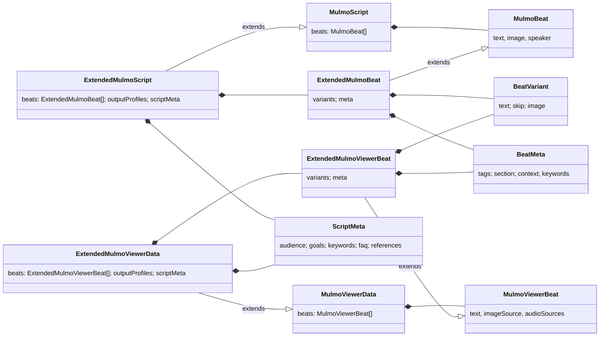
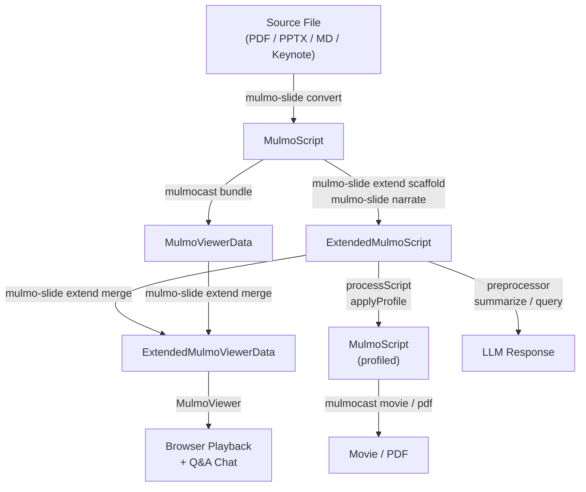
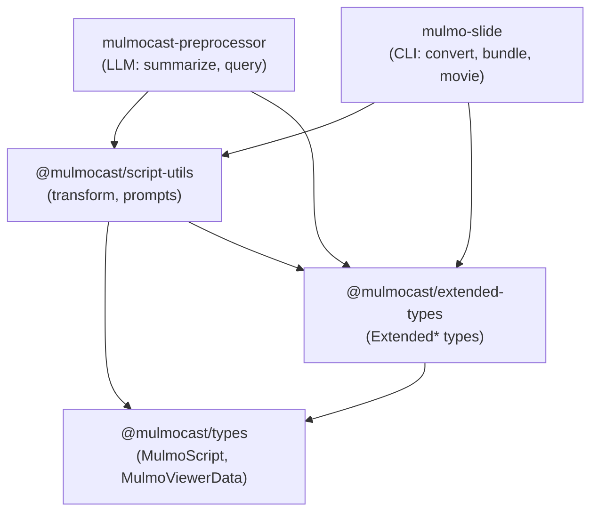

# @mulmocast/extended-types

Extended type definitions for MulmoScript / MulmoViewerData, adding variant support, content metadata, and output profiles.

## Type Hierarchy



### Defined in

| Package | Types |
|---|---|
| `@mulmocast/types` | MulmoScript, MulmoBeat, MulmoViewerData, MulmoViewerBeat |
| `@mulmocast/extended-types` | Extended\* types, BeatVariant, BeatMeta, ScriptMeta, OutputProfile |

## Data Lifecycle



### Type Usage by Package

| Type | Produced by | Consumed by |
|---|---|---|
| **MulmoScript** | `mulmo-slide` converters (marp, pptx, pdf, keynote, markdown, transcribe) | `mulmocast` (movie, pdf, bundle), preprocessor, scaffold |
| **ExtendedMulmoScript** | `mulmo-slide extend scaffold`, `narrate`, `assemble-extended` | `mulmocast-preprocessor` (process, summarize, query), `extend merge` |
| **MulmoViewerData** | `mulmocast` bundle generation | `extend merge` (base for merging metadata) |
| **ExtendedMulmoViewerData** | `mulmo-slide extend merge` | MulmoViewer (browser playback, Q&A chat) |

### Key Transformations (`@mulmocast/script-utils`)

| Function | Input | Output |
|---|---|---|
| `processScript` | ExtendedMulmoScript | MulmoScript |
| `applyProfile` | ExtendedMulmoScript | MulmoScript |
| `stripExtendedFields` | ExtendedMulmoScript | MulmoScript |
| `scriptToViewerData` | ExtendedMulmoScript | ExtendedMulmoViewerData |
| `buildScriptContent` | ExtendedMulmoViewerData | string (for LLM prompt) |

### File Conventions

| Type | File Path |
|---|---|
| MulmoScript | `scripts/{basename}/{basename}.json` |
| ExtendedMulmoScript | `scripts/{basename}/extended_script.json` |
| MulmoViewerData / ExtendedMulmoViewerData | `output/{basename}/{basename}/mulmo_view.json` |

## Package Dependencies



## Installation

```bash
yarn add @mulmocast/extended-types
```

## License

MIT
