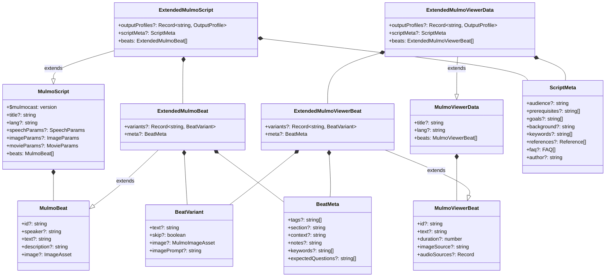
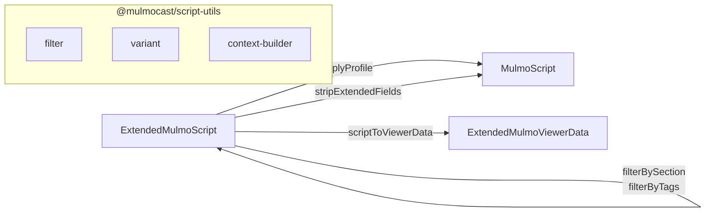
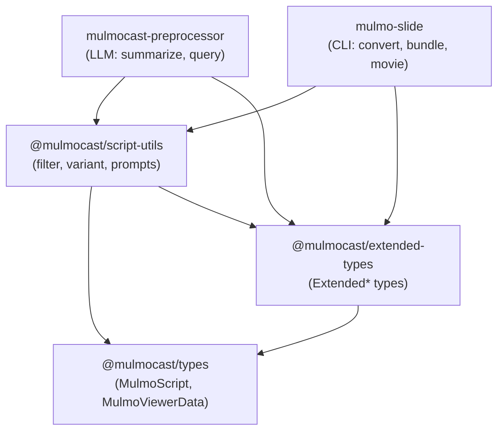
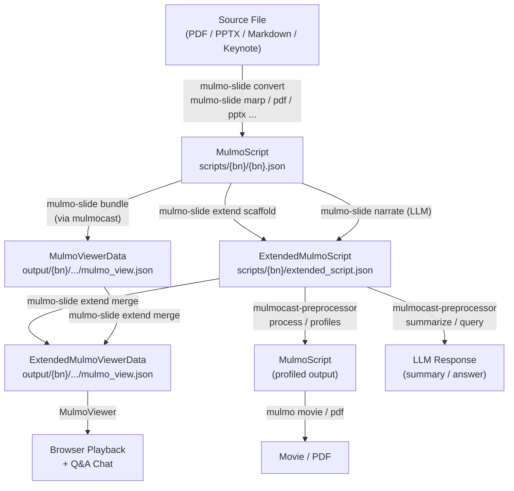

# @mulmocast/extended-types

Extended type definitions for MulmoScript / MulmoViewerData, adding variant support, content metadata, and output profiles.

## Type Hierarchy



## Conversion Flow



| Operation | Input | Output | Description |
|---|---|---|---|
| `filterBySection` / `filterByTags` | ExtendedMulmoScript | ExtendedMulmoScript | Filter beats while preserving metadata |
| `applyProfile` | ExtendedMulmoScript | MulmoScript | Apply variant overrides, remove extended fields |
| `stripExtendedFields` | ExtendedMulmoScript | MulmoScript | Remove all extended fields |
| `scriptToViewerData` | ExtendedMulmoScript | ExtendedMulmoViewerData | Extract viewer-relevant fields for playback/Q&A |
| `processScript` | ExtendedMulmoScript | MulmoScript | Filter + applyProfile (full pipeline) |

## Package Relationships



## Data Lifecycle



### Type Usage by Package

| Type | Produced by | Consumed by |
|---|---|---|
| **MulmoScript** | `mulmo-slide` converters (marp, pptx, pdf, keynote, markdown, transcribe) | `mulmocast` (movie, pdf, bundle), `mulmocast-preprocessor`, scaffold |
| **ExtendedMulmoScript** | `mulmo-slide extend scaffold`, `mulmo-slide narrate`, `mulmo-slide assemble-extended` | `mulmocast-preprocessor` (process, summarize, query), `extend merge` |
| **MulmoViewerData** | `mulmocast` bundle generation | `extend merge` (base for merging metadata) |
| **ExtendedMulmoViewerData** | `mulmo-slide extend merge` | MulmoViewer (browser playback, Q&A chat) |

### Type Usage by Function (`@mulmocast/script-utils`)

| Function | Input | Output | Used by |
|---|---|---|---|
| `processScript` | ExtendedMulmoScript | MulmoScript | preprocessor CLI |
| `applyProfile` | ExtendedMulmoScript | MulmoScript | processScript |
| `filterBySection` / `filterByTags` | ExtendedMulmoScript | ExtendedMulmoScript | processScript, preprocessor query/summarize |
| `stripExtendedFields` | ExtendedMulmoScript | MulmoScript | processScript (default profile) |
| `scriptToViewerData` | ExtendedMulmoScript | ExtendedMulmoViewerData | preprocessor interactive query |
| `buildScriptContent` | ExtendedMulmoViewerData | string | mulmo-slide Q&A chat (browser) |

### File Conventions

| Type | File Path |
|---|---|
| MulmoScript | `scripts/{basename}/{basename}.json` |
| ExtendedMulmoScript | `scripts/{basename}/extended_script.json` |
| MulmoViewerData / ExtendedMulmoViewerData | `output/{basename}/{basename}/mulmo_view.json` |

## Installation

```bash
yarn add @mulmocast/extended-types
```

## License

MIT
