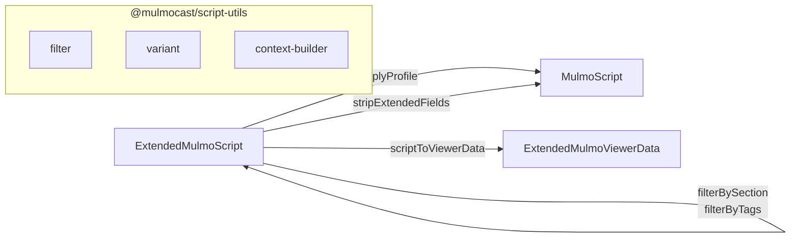
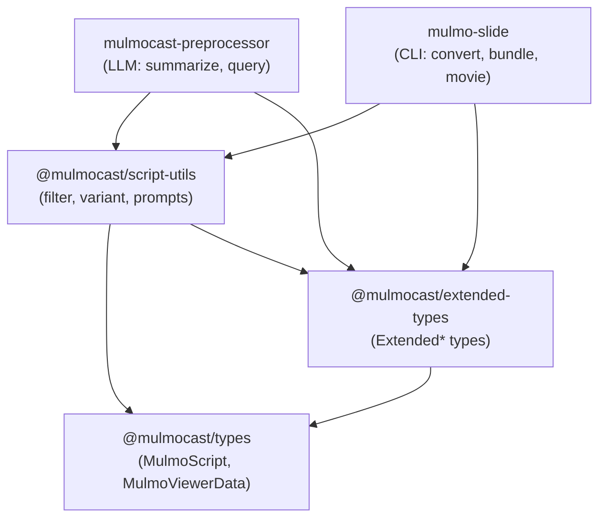

# @mulmocast/extended-types

Extended type definitions for MulmoScript / MulmoViewerData, adding variant support, content metadata, and output profiles.

## Type Hierarchy


## Conversion Flow



| Operation | Input | Output | Description |
|---|---|---|---|
| `filterBySection` / `filterByTags` | ExtendedMulmoScript | ExtendedMulmoScript | Filter beats while preserving metadata |
| `applyProfile` | ExtendedMulmoScript | MulmoScript | Apply variant overrides, remove extended fields |
| `stripExtendedFields` | ExtendedMulmoScript | MulmoScript | Remove all extended fields |
| `scriptToViewerData` | ExtendedMulmoScript | ExtendedMulmoViewerData | Extract viewer-relevant fields for playback/Q&A |
| `processScript` | ExtendedMulmoScript | MulmoScript | Filter + applyProfile (full pipeline) |

## Package Relationships



## Installation

```bash
yarn add @mulmocast/extended-types
```

## License

MIT
